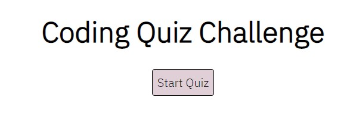
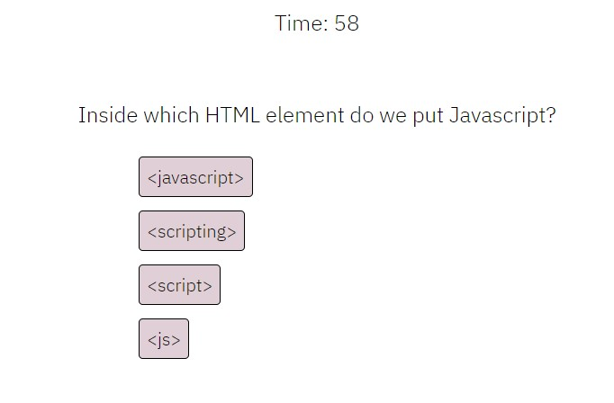
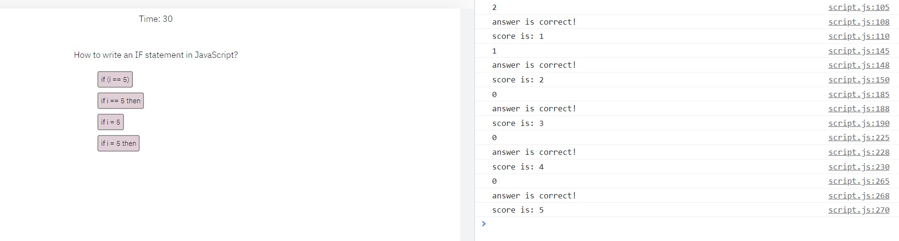
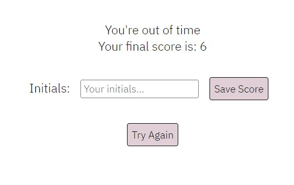

# Module-04-Challenge

## User Story

```
AS A coding boot camp student
I WANT to take a timed quiz on JavaScript fundamentals that stores high scores
SO THAT I can gauge my progress compared to my peers
```

## Acceptance Criteria

```
GIVEN I am taking a code quiz
WHEN I click the start button
THEN a timer starts and I am presented with a question
WHEN I answer a question
THEN I am presented with another question
WHEN I answer a question incorrectly
THEN time is subtracted from the clock
WHEN all questions are answered or the timer reaches 0
THEN the game is over
WHEN the game is over
THEN I can save my initials and score
```

## Screenshots



Start of quiz.



Quiz running with simple formatting.



Console log to show each correct/incorrect answer and current score.



Final score is calculated from time left and correct answers. For every incorrect answer, a point is subtracted from the time left to produce the final score.

## Link

[https://carolinemae.github.io/Module-04-Challenge/](https://carolinemae.github.io/Module-04-Challenge/)